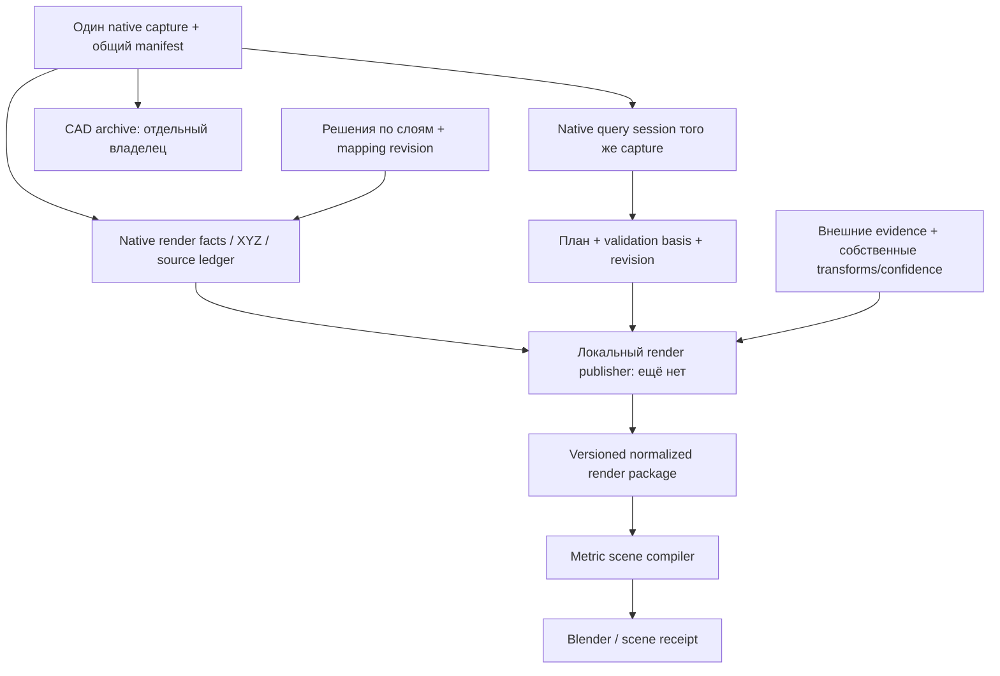

# Native capture → render / Blender

Статус: **draft / integration-not-implemented**. Дата: 23 сентября 2026.

Это проект контракта стыка, а не реализованный DTO, endpoint, доказательство
готовности native-query backend или установленного комплекта. Проверены исходники
рабочего дерева `codex/field-audit-fixes`, HEAD
`1d35d9c2a5baf1a793d9927400474e0a26c130b9`, включая незакоммиченные изменения.
Параллельный перенос native kernel и исследование capture archive не завершены.
Имена новых DTO и файлов ниже — предложения для согласования с их владельцами.

Основания: [AutoCAD-контракт](autocad-contract.md),
[план native-query от 23 сентября](../implementation/2026-09-23-native-query-integration-plan.md),
[metric-scene handoff](../implementation/2026-09-23-metric-scene-package.md),
[render map-context handoff](../implementation/2026-09-23-render-map-context.md),
[реестр разрывов](../audits/2026-09-22-cad-pipeline.md).
Этот документ не разрешает новый CAD-парсер, развитие sampled-преобразователя,
изменение геометрического алгоритма или обход проверок целостности.

## 1. Решение и фактические маршруты

Render получает производные данные **того же native-захвата**, к которому
привязан расчёт, плюс зафиксированную ревизию посадок и отдельно внешние evidence.
Посадки появляются после захвата: «тот же захват» означает доказанную связь их
основания с capture, а не нахождение будущих растений в исходном DWG.
Render не читает DWG/DXF и архивные XREF. Расчёт не использует render mesh,
LOD, гладкую поверхность высот, GIS-footprints или результат Blender.

### Существующий код, не сквозная приёмка

1. [delivery_command.cpp](../../tools/autocad-bridge/native/delivery_command.cpp),
   `gaOpenInService`, строки 49–81: текущий GAOPEN вызывает
   `captureLiveSnapshotForService`, пишет `Drawing.autocad.json`, затем live ticket.
   Это новее исторической схемы DXF round trip в аудите C02.
2. [capture_commands.cpp](../../tools/autocad-bridge/native/capture_commands.cpp),
   `captureTopology` / `captureLiveSnapshotForService`: обход текущей native БД;
   [snapshot_writer.cpp](../../tools/autocad-bridge/native/snapshot_writer.cpp),
   `writeTopologySnapshot`: `green-atlas.autocad-region-topology-probe/1`.
   В файле есть WCS XYZ, coverage, единицы и сведения о документе. Это display/
   topology capture, не сериализованная готовая native-query сессия.
3. [desktop/tickets.py](../../apps/api/app/desktop/tickets.py), `LiveTicket`:
   `green-atlas.transfer/2`, один `LiveCaptureFile` с именем, SHA и размером;
   [desktop/handoff.py](../../apps/api/app/desktop/handoff.py), `run_live`:
   `import_autocad_live_file` → контролируемый
   [live_worker.execute](../../apps/api/app/dxf_import/live_worker.py) →
   [ImportApplication.import_autocad_live](../../apps/api/app/dxf_import/application.py).
4. [compiler.py](../../apps/api/app/cad_bridge/compiler.py),
   `compile_live_document` → `CadSnapshot` (`green-atlas.autocad-snapshot/1`) →
   [provider.py](../../apps/api/app/cad_bridge/provider.py),
   `build_dxf_import_from_snapshot` / `apply_cad_snapshot` → геометрия проекта.
   Live import сохраняет исходные JSON bytes как source; это не CAD-архив.
5. Отдельный существующий web-путь:
   [api.py](../../apps/api/app/api.py), `GET /projects/{project_id}/plan/scene`
   (строка 573) → [SceneApplication.get_scene](../../apps/api/app/scene/application.py)
   → [build_scene](../../apps/api/app/scene/domain.py) → `SceneSnapshot` → web/Three.
   Этот DTO не является входом Blender CLI.
6. Отдельный существующий Blender-путь:
   [run_metric_scene.py](../../scripts/cad-lab/run_metric_scene.py) →
   [assemble_metric_scene.py](../../scripts/cad-lab/assemble_metric_scene.py),
   `compile_package` → `scene.json` + `receipt.json` →
   [open_metric_scene_blender.py](../../scripts/cad-lab/open_metric_scene_blender.py)
   → `scene.blend`. Между пунктами 4/5 и 6 **нет native render publisher**.
7. Добавленный [fetch_overture_render_context.py](../../scripts/cad-lab/fetch_overture_render_context.py)
   скачивает внешний контекст по переданным WGS84 bbox/release и пишет
   `green-atlas.overture-render-context.v1`. Он CAD не читает, CRS/controls не
   принимает и привязку не вычисляет. Связь его результата с capture и metric
   scene остаётся задачей publisher; точная сверка — в разделе 5.

`cad_origin="autocad_capture_derived"` уже разрешён сборщиком, но сейчас это
проверка строкового значения, не проверка capture identity. Рабочий демонстрационный
[rebuild/manifest.json](../../artifacts/metric-scene-20260923/rebuild/manifest.json)
явно имеет `historical_legacy_processed_fixture`.

Восстановленный красивый «native render» — другое значение слова native:
Blender без ImageGen. [run_restored_native_demo.py](../../scripts/cad-lab/run_restored_native_demo.py)
передаёт `--project-dxf` в
[compile_kustanayskaya_controlled_scene.py](../../scripts/cad-lab/compile_kustanayskaya_controlled_scene.py),
где `ezdxf.readfile` находится на строке 336. Этот исторический маршрут нельзя
использовать как адаптер нового capture или добавлять к нему новые зависимости.

## 2. Current / required: поля и реальные источники

Ссылки указывают на существующие DTO/функции; правая колонка описывает **требования**.

| Данные | Current: что действительно существует | Required: чего нет на стыке |
|---|---|---|
| Source/capture | [SnapshotSource, LiveDocumentCapture, SnapshotSummary](../../apps/api/app/cad_bridge/contracts.py): `source.sha256`, `document_revision`, `live_capture.original_path`, `original_disk_sha256`, `database_modified_flags`, `summary.payload_sha256` | Общий `capture_id`, неизменяемый manifest состояния и его digest, связь native session / render / archive. DBMOD, GUID или путь по отдельности не доказывают совпадение состояний |
| Семантика SHA | `compile_live_document` хеширует raw JSON bytes в `source.sha256`; `original_disk_sha256` — хеш старого файла на диске; `payload_sha256` — канонический нормализованный payload без summary | Раздельные имена для этих трёх hashes; отдельный hash CAD-комплекта. Нельзя назвать JSON hash хешем DWG или доказательством упаковки XREF |
| Build | [ExtractionEvidence](../../apps/api/app/cad_bridge/contracts.py): `autocad_version`, `plugin_version`, `target`, `requested_tolerance_m`; ticket содержит producer/version | SHA фактически исполняемого native бинарника, protocol/kernel version, build renderer/exporter; привязка query receipt к этому комплекту. Версия плагина не заменяет binary hash |
| Адрес объекта | `SourceIdentity(handle, instance_chain)`, geometry `id/content_sha256`, `RegionGeometry.derived_from`; `CoverageRecord.layer/dependency_ids` | `capture_id + source_database_id + instance_chain + handle`, part/face IDs и полная связь output→source. Handle без экземпляра не уникален |
| Слои/покрытия | Raw probe хранит `source_layer` и effective `layer`. [Layer](../../apps/api/app/dxf_import/layer_contracts.py) содержит `id/source_name/mapped_kind/mapping_confirmed`; provider выдаёт `properties.kind/source_layer/source_handle/source_instance_chain` | Сохранить исходное и effective имя раздельно; render `class` и его основание/решение/ревизию. `LayerKind` не имеет `sidewalk/lawn/marking/special_surface`; `existing_green` нельзя автоматически переименовать в lawn |
| Высоты | `PointGeometry.coordinates`, `RegionLoop.coordinates`, `PathGeometry.coordinates` содержат XYZ. Native point применяет `accumulatedTransform` в [entity_extraction.cpp](../../tools/autocad-bridge/native/entity_extraction.cpp), строки 140–159 | Native annotation/attribute evidence и связь подпись→измеренная точка, смысл Z, datum, единицы числовой отметки, подтверждение terrain. Текст/MTEXT сейчас только context coverage, без текста/anchor в DTO |
| Вертикаль проекта | [GeometrySnapshot.vertical_primitives / DxfVerticalPrimitive](../../apps/api/app/geometry/contracts.py), [SceneVerticalPrimitive](../../apps/api/app/scene/contracts.py) уже моделируют XYZ/terrain evidence | Native provider эти primitives не наполняет: `_native_shape` проецирует XYZ в XY. Legacy `source_space="dxf_wcs"` и evidence enums не являются готовым native-протоколом |
| Units / CRS | Raw `source.units_code/metres_per_unit`; provider переводит XY в метры по units code. [CoordinateReference](../../apps/api/app/geometry/contracts.py): `status/crs_id/axis_order/origin_wgs84/...`; native provider устанавливает `unknown/none` | Подтверждение физического масштаба, frame каждого файла, матрицы экземпляров, CAD→WGS84 и обратное преобразование с confidence. При отсутствии CRS: явный `georeference.status="absent"`, а не EPSG по предположению |
| Посадки | [Plan/PlanObject](../../apps/api/app/planning/contracts.py): plan `id/version`, object `id/kind/x/y/species_revision_id/layout_radius_m/status`, forecasts; [Project](../../apps/api/app/projects/contracts.py): `id/state_version/geometry_version`; `ScenePlantObject` даёт local XY и диапазоны высот/крон | Экспорт проектных деревьев **и кустов**, связанный с source/capture/mapping/validation revision; ground Z и evidence отдельно. Metric CLI читает только inventory tree records/positions, не `Plan.objects` |
| Проверка посадок | [PlanValidationBasis](../../apps/api/app/validation/contracts.py): `plan_version/geometry_version/validator_revision/objects_digest` | `capture_id`, digest комплекта, native backend/build/query receipt; `valid` старого объекта не подтверждает новую native-проверку |
| Coverage / XREF | `CoverageRecord.status/method/reason/geometry_ids/dependency_ids/unresolved_reference`; `CadSnapshotDependency` имеет SHA/bytes; `LiveCadReference` — только адрес ссылки, без обещания архива | Один ledger capture→render: unavailable/unloaded/ambiguous/unarchived XREF, unknown geometry/semantics/height, extent или unlocated, причины исключения каждого output. Полный ledger не равен полной геометрии |
| Внешние evidence | CLI принимает WGS84 `map_buildings/map_roads` и candidate alignment, фиксирует входные hashes | Overture release/dataset/feature IDs, license/attribution, исходная CRS, отдельные transform/confidence/coverage, link к native при сравнении; никакой подмены native footprint |

### Точные текущие render DTO и потери

`green-atlas.metric-scene-input.v1` в `compile_package` содержит
`schema`, `cad_origin`, `vertical_datum`, `inputs.<name>={path, sha256?}`.
`read_input` проверяет SHA, только если он указан, и записывает фактический SHA.

| Input path | Текущий формат потребителя |
|---|---|
| `inputs.cad_surfaces` | GeoJSON `Polygon`, `properties.class ∈ {road, sidewalk, lawn, marking, special_surface}`, необязательные `source_handle/source_layer`; XY уже метрические |
| `inputs.elevation_controls` | GeoJSON `Point` XY + числовое `properties.z_m`; `fit_ground` требует ≥6 разных XY и rank 6 |
| `inputs.cad_buildings` | Необязательные Polygon с `address`, `source_handle`/feature `id`, `height/height_m` либо `num_floors/building:levels` |
| `inputs.map_buildings/map_roads` | Необязательные WGS84 features; дороги используются как оси. В текущем коде alignment инициализируется внутри ветки `if mapped`, поэтому одни roads без map_buildings не отрисуются |
| `inputs.alignment` | `reference_lon_lat`, `scale`, `rotation`, `translation`, `status`; либо старое `similarity_transform_row_vector` + `projection_before_fit` |
| `inputs.inventory_records` | Словарь по inventory ID: `kind="tree"`, `species`, `height_m` |
| `inputs.inventory_positions` | `positions[id].position_status="matched_marker"`, `xy_dxf_m`; это историческое имя поля, не разрешение читать DXF |

`green-atlas.metric-scene.v1` содержит `origin_cad_xy_height_m`,
`scope_bounds_local_m`, `terrain`, `alignment`, `surfaces`, `buildings`, `trees`,
`road_axes`, `sources`, `warnings`, `summary`.
Receipt содержит только `manifest_sha256`, `scene_sha256`, summary/warnings.
Capture/project/build/revision envelope сквозь CLI не проходит.

Конкретные ограничения [compile_package](../../scripts/cad-lab/assemble_metric_scene.py):

- Строки 239–245: MultiPolygon не поддержан входом surfaces; строки 281–286:
  у зданий сохраняется только exterior, отверстия теряются.
- Строки 318–320: surface ID берётся из одного `source_handle` либо индекса;
  instance chain, dependency IDs, geometry hash и решения по слоям теряются.
- Строки 307–311: native и внешние footprints объединяются для вычитания из
  газона. Это визуальная производная; она не удовлетворяет требованию отдельного
  Overture evidence слоя и не может стать новой native-площадью.
- Строки 339–351: inventory tree исчезает при отсутствии matched marker,
  высоты, газона либо попадании в building/вне height hull; индивидуальный
  ledger таких исключений отсутствует. Для проектных посадок это неприемлемо.
- [Blender surface_objects](../../scripts/cad-lab/open_metric_scene_blender.py)
  объединяет все поверхности класса в один mesh без object→source mapping;
  `tree_objects` именует ID инвентаризационным. Scene properties сохраняют
  путь packet/status, но не capture/revisions/hash.
- Web `scene_context` упрощает контуры на 0,15 м и `SceneContextFeature`
  не переносит instance chain. Его output — LOD просмотра, не источник для
  восстановления полных render-входов или для CAD-расчёта.

## 3. Предлагаемый DTO единого render-входа

Все DTO в этом разделе **required, не существуют в коде**. Предложенное имя
envelope: `NativeRenderCaptureManifest`, schema
`green-atlas.native-render-capture/1-draft`. Изменение опубликованного v1
«добавлением полей, которые потребитель игнорирует» не считается интеграцией.
Нужен явный адаптер/версионированный consumer и его контрактные проверки.

### Envelope и идентичность

| Поле | Смысл / обязательность |
|---|---|
| `schema`, `status` | Версия; для настоящего документа `draft/integration-not-implemented`, для будущего результата отдельный review status |
| `capture.id`, `capture.manifest_sha256` | Идентичность согласованного состояния, выданная общим capture owner; один и тот же reference у query и render |
| `capture.document_revision`, `capture.database_modified_flags` | Evidence live-документа; не самостоятельный ключ кеша |
| `capture.raw_snapshot_sha256`, `capture.normalized_payload_sha256` | Раздельные hashes существующих raw/normalized представлений |
| `capture.original_disk_sha256` | Только контекст дискового оригинала, nullable для будущей поддержки никогда не сохранённого документа |
| `capture.archive` | `{status, manifest_sha256?, reason?}`: reference на результат archive owner, не путь для renderer; без архива состояние не получает export/replay-ready |
| `producer` | `autocad_version`, `target`, `plugin_version`, `plugin_binary_sha256`, `native_kernel_revision`, `query_protocol_version` |
| `project` | `id`, `state_version`, `geometry_version`, `layer_mapping_revision`, `layer_mapping_sha256` |
| `plantings` | `plan_id`, `plan_version`, `objects_digest`, `horizon_year`, pinned species revisions, reference на plants file и validation basis |
| `frames`, `georeference`, `vertical_reference` | Правила раздела 4, всегда явны, в том числе когда evidence отсутствует |
| `inputs`, `coverage`, `external_evidence` | Ссылки на файлы с `path/sha256/bytes/schema/frame_id`; пути относительно package root |
| `map_context_request` | Reference/hash запроса внешнего контекста: AOI с основанием, alignment/controls и capture/revision envelope из раздела 5 |
| `derivation` | `exporter_build`, `render_schema`, policy/LOD/tessellation parameters, hashes решений и внешних входов |

Поле с неизвестным фактом содержит `null` + status/reason, а не правдоподобное
значение. Неизвестный binary hash нельзя заменить Git HEAD исходников.
Capture manifest не хеширует сам себя: его digest вычисляется по отдельно
оговорённому immutable payload без собственного digest/производных render receipt.

`NativeSourceRef`:

```text
capture_id, source_database_id, dependency_ids[],
handle, instance_chain[], entity_type,
source_layer, effective_layer, layer_id,
geometry_id?, geometry_content_sha256?, derived_from[], instance_transform_id
```

`source_database_id` ссылается на host/XREF из capture ledger, а не на basename
или абсолютный пользовательский путь. Геометрические transforms и database
identity выдаёт native producer. Renderer не разбирает chain для чтения CAD.

`feature_id`/`primitive_id` детерминированы из capture + полного source address +
kind/part_id; `content_sha256` хранится отдельно. Face/part IDs должен выдавать
producer, их нельзя получать из порядка треугольников после LOD. Один объект
может давать несколько faces/meshes; каждый сохраняет исходные refs. Для native
области из нескольких кривых передаются все `derived_from` и основание решения.
Повторная сборка, камера и LOD не меняют ID. Стабильность между разными capture
не обещается без явного migration/correspondence ledger. Plant `object_id`
сохраняется при редактировании плана независимо от render mesh ID.

### Поверхности, отметки и растения

`NativeRenderSurface` содержит `feature_id`, `source_refs[]`, метрические
`Polygon/MultiPolygon` с отверстиями либо mesh из native display export,
`frame_id`, `geometry_status`, `render_tolerance_m`, `semantic` и `vertical`.

`semantic={class, status, basis, decision_id?, mapping_revision}`:
`class = road | sidewalk | lawn | marking | special_surface | building | unknown`;
`status = confirmed | proposed | unknown`. Основание указывает на авторскую
семантику или сохранённое решение пользователя, с адресами evidence.
Имя слоя, цвет, area presence и `mapped_kind=road` сами по себе не доказывают
различие проезжей части/тротуара/разметки. `allowed/site-minus-forbidden` не lawn.
Открытая линия остаётся линией: нельзя строить road polygon из оси, ширины по
умолчанию или хорды. Unknown показывается с замечанием, без переименования.

`ElevationControl` содержит `control_id`, `source_refs[]`, `xy_wcs_m`,
`z_m: number|null`, `raw_xyz_wcs?`, `elevation_role`, `value_evidence`,
`vertical_datum_id?`, `datum_status`, `unit_evidence`, `review_status`.
Для подписанной отметки нужны `annotation_ref`, raw text/attribute value,
числовое значение с единицами, `anchor_ref` и основание связи с точкой.
Insertion Z текста не является значением написанной отметки; Z точки не
становится отметкой земли без `elevation_role=ground`. Text height не building height.
Семантическая нормализация работает с native-полями, не с чтением DXF.

`RenderPlanting` содержит:

```text
object_id, kind: tree|shrub, origin: project_plan,
plan_id, plan_version, capture_id, xy_wcs_m,
species_revision_id?, size_class, model_variant_key?,
horizon_year, canopy_radius_min_m/max_m, height_min_m/max_m,
height_status, growth_stage/status, layout_radius_m,
ground_z_m?, ground_z_evidence, ground_support_status,
validation_status, validation_basis, issue_refs[],
planting_zone_id?, pattern_id?, group_ids[], locked
```

`validation_basis` расширяет существующий `PlanValidationBasis` ссылками на
capture/комплект, mapping revision, backend/build и query receipt. Отсутствие
этой связи даёт `unknown`/`stale`, даже если сохранённый `PlanObject.status=valid`.
Поля `[min,max]` — оценка каталога/прогноза; выбранный для модели размер получает
отдельный selection policy, не выдаётся за измеренную высоту. Layout radius
не подменяет радиус взрослой кроны.

Нельзя экспортировать plan через `inventory_records/positions` или ставить
`matched_marker` проектному растению. Инвентаризация — отдельный источник с
`origin=inventory`, своим record ID и source evidence. Любой renderer сохраняет
точное XY проектных деревьев и кустов, включая проблемные. Нет ground Z — явный
2D/diagnostic proxy либо запись об отсутствии 3D; растение не исчезает и не
перемещается на ближайший lawn. Blender не валидирует допустимость посадки.

## 4. Единицы, frames, CAD→WGS84 и вертикаль

### Native → метрический CAD → локальный Blender

Для ещё не преобразованного local entity point:

```text
p_host_units = M_instance_to_host_wcs × [x_local, y_local, z_local, 1]^T
p_cad_m = metres_per_host_unit × p_host_units.xyz
p_blender_m = p_cad_m - render_origin_cad_m
```

Матрица полная affine 4×4, включая вложенность, reflection и nonuniform scale.
В DTO явно записываются layout `row-major`, умножение `column-vector`, направления
from/to, unit и точность. Native producer нормализует представление AutoCAD.
[xref_instance_access.cpp](../../tools/autocad-bridge/native/xref_instance_access.cpp),
`ga::xref::resolve`, использует авторитетный `AcDbCompoundObjectId.getTransform`;
это существующая точка получения матрицы для общего kernel, не обещание её
наличия в текущем snapshot JSON.

Raw geometry snapshot уже в host WCS: `M_instance_to_host_wcs` к ней **повторно
не применяется**. Provider GeoJSON уже в метрах: scale повторно не применяется.
Для каждого файла обязательны `frame_id`, `coordinates_already_in_host_wcs`,
`unit_scale_applied`. Нельзя домножать XREF ещё раз по его INSUNITS: различие
INSUNITS и фактической матрицы — отдельное замечание физического масштаба.

Blender frame: метры, правая система, X/Y как у CAD, Z вверх, явный origin XYZ
и обратное преобразование. В текущем CLI origin — центр bbox покрытий + fitted Z;
у web `scene_origin` — центр посадок (или source bounds), только XY. Поэтому
`ScenePlantObject.local_x/local_y` нельзя копировать в CLI `xyz` напрямую:
восстановить CAD XY через `SceneSnapshot.coordinate_origin`, затем вычесть
origin конкретного render-пакета. Предпочтителен экспорт исходных `PlanObject.x/y`.
Округление mesh до 0,0001 м в `mesh_polygon` — render precision, не query tolerance.

### Геопривязка не выводится из WCS или имени улицы

Обязательный DTO `georeference`:

```text
status: absent|candidate|declared|verified
cad_crs_id: string|null
wgs84_axis_order: lon_lat
cad_to_wgs84: TransformRef|null
wgs84_to_cad: TransformRef|null
evidence_refs[], reason?
```

У `TransformRef`: `id`, `from_frame/to_frame`, `method`, parameters/pipeline,
версия реализации, `valid_extent`, `transform_confidence`, control point refs,
RMSE/max residual в метрах и revision/digest. Горизонтальное преобразование
не преобразует высотный datum. Наличие candidate fit не означает известную CAD CRS.

Для current native provider: `cad_crs_id=null`, `status=absent`, оба transform
`null`, reason `native_snapshot_has_no_geodetic_reference`. Допустим локальный
CAD render. Внешний слой остаётся unaligned до появления явного transform;
нет автоматического совмещения по origin=(0,0), координатам «похожего диапазона»
или предполагаемому EPSG. Сохранённый GIS-fit может дать candidate-связь с
конкретным внешним слоем при по-прежнему неизвестной CAD CRS.

Текущий CLI реализует только кандидатное **WGS84→CAD** отображение
`map_to_cad`, а не опубликованный двунаправленный CRS-контракт:

```text
q = (R * rad(lon-lon0) * cos(rad(lat0)), R * rad(lat-lat0))
c_xy_m = s * q @ rotation + translation          # row-vector
q = ((c_xy_m - translation) @ inverse(rotation)) / s
lon = lon0 + deg(q.x / (R * cos(rad(lat0))))
lat = lat0 + deg(q.y / R)
```

Здесь `R=6378137`, `reference_lon_lat=[lon0,lat0]`. Обратные формулы —
**предлагаемая спецификация inverse существующего fit, код inverse отсутствует**.
Это локальная equirectangular аппроксимация в пределах control extent, не
подтверждённая геодезическая проекция. Нужны проверка обратимости и round-trip
контроли. Для известной CRS передаётся проверенный transform pipeline;
renderer не выбирает CRS и не запускает address fitting заново для каждой камеры.

### Вертикаль

`vertical_reference={status: absent|local|declared|verified, datum_id?, unit:"m",
offset_to_datum_m?, evidence_refs[]}`. Нельзя копировать строку
`"Moscow height system"` из demo manifest на новую улицу или приписывать нулю
в DWG высоту над уровнем моря. Неизвестное смещение — `null`, не 0.
XYZ в локальном datum можно показать с соответствующим статусом; смешивать
его с внешними высотами без vertical transform нельзя.

Ground, base building elevation, building height и biological plant height —
разные величины. Каждый Z получает источник и confidence. Current `fit_ground`
делает робастную квадратичную поверхность, ограничивает её hull отметок и
пишет `estimated_smooth_surface_from_source_labels`, RMSE, `microrelief=unknown`.
Это render estimate, не инженерный TIN и не вход native membership/distance.
Недостаток контролей сейчас останавливает CLI; требуемая интеграция должна
вернуть capability `volumetric_render=unavailable` и сохранить доступный
просмотр/план с замечаниями. Этот документ не меняет алгоритм интерполяции.

## 5. Внешние evidence и coverage

`ExternalEvidenceLayer` содержит `id`, `provider` (например Overture),
`dataset/release`, `downloaded_at`, `source_url`, `license/attribution`,
`file_sha256`, `original_crs/axis_order`, `feature_id_namespace`, исходную geometry,
`transform_ref`, отдельный `transform_confidence`, `coverage_extent/status`.
Ни dataset version, ни native `capture_id` не подменяют друг друга: внешний
snapshot фиксируется в render manifest как независимый вход.

Overture buildings, building parts и segments сохраняются в отдельной evidence collection.
После подтверждённого или кандидатного преобразования они могут показываться
рядом с CAD. Совпадения имеют `comparison_refs`/overlap diagnostics. Внешний
footprint не заменяет native, не становится native-препятствием и не вырезается
из авторского lawn в каноническом capture. Визуальное подавление дублей допустимо
только как записанная render policy; исходные записи и provenance сохраняются.
Внешняя высота, даже явная в GIS, сохраняет своё происхождение, а этажность×3 м —
оценочный статус. Segment остаётся centerline; неизвестная ширина дороги — `null`.

### Сверка нового render-стыка: 23 сентября

Проверены [render-map-context.md](../implementation/2026-09-23-render-map-context.md)
и фактические `parse_bbox`, `write_manifest`, `main` в
[fetch_overture_render_context.py](../../scripts/cad-lab/fetch_overture_render_context.py).
Границы совпадают: загрузчик работает только с внешней картой, raw context
остаётся `unmatched_external_context`, native footprints сохраняют своё
происхождение. Полная загрузка трёх типов в handoff помечена незавершённой;
эта сверка её не выполняла.

**Current input:** `--bbox west,south,east,north`, `--release`, `--output`.
`parse_bbox` проверяет конечность, диапазон координат и размер не более 0,1°
по каждой оси; это численная валидация, не доказательство геопривязки AOI.
Нельзя передать CAD bounds прямо в этот аргумент. Более крупные AOI требуют
явного разбиения с учётом coverage всех частей; antimeridian bbox текущим
форматом не поддержан.

**Current output:** `context-manifest.json` с полями `schema`, `source`,
`release`, `bbox_wgs84`, `status`, `usage` и
`features.{building,building_part,segment}.{path,sha256,feature_count}`;
рядом три одноимённых `.geojson`. Manifest не содержит capture identity,
source/project/plan revisions, alignment ID/confidence, vertical datum,
license/attribution, download timestamp или статуса пространственной полноты.
`bbox_wgs84` — рамка запроса, `feature_count` — число возвращённых features;
ни то ни другое не доказывает полноту исходного CAD или внешней карты.
Raw feature IDs/GERS и `sources[]`, если они есть в ответе провайдера, должны
сохраняться при нормализации; текущий `write_manifest` их не проверяет.

**Required handoff:** новый `RenderMapContextRequest` (DTO ещё не реализован),
ссылка на который хранится в общем envelope:

| Поле | Что передаётся render-владельцу |
|---|---|
| `capture_ref`, `project_ref`, `plantings_ref` | Общие capture ID/manifest SHA, document revision, project state/geometry/mapping revisions, plan ID/version/objects digest; определения из раздела 3 |
| `cad_scope` | Polygon/MultiPolygon либо bounds в явно указанном CAD frame/metres, source refs и coverage ledger; рабочая область не объявляется полным источником |
| `aoi_wgs84` | `bbox:[west,south,east,north]` либо `null`, `status:available/unavailable`, `basis`, evidence refs, `margin_m`, `transform_ref?`, `request_scope_id` |
| `georeference` | `absent/candidate/declared/verified`, `cad_crs_id`, transform в обе стороны, valid extent, confidence; неизвестная CRS остаётся `null` |
| `alignment_controls` | Reference/hash набора контрольных пар или `null`, причина отсутствия, candidate fit/holdout receipt при наличии |
| `vertical_reference`, `elevation_controls_ref` | Datum/status/offset/evidence и native высотные отметки из раздела 4; горизонтальная привязка не подтверждает Z |
| `coverage_ref` | Ledger native object/XREF unknown/unlocated; отдельно request/download/transformed coverage внешнего слоя |
| `external_request` | Конкретный release и типы `building/building_part/segment`; проверенная рамка и её основание фиксируются до загрузки |

`aoi_wgs84.basis` различает `verified_crs_transform`,
`independently_confirmed_search_area` и `reviewed_alignment_transform`.
Известная поисковая рамка на карте позволяет скачать кандидатов для дальнейшего
сопоставления, но **не устанавливает CAD→WGS84**: `georeference` может остаться
`absent`. Если рамка получена из candidate alignment, записываются его status,
confidence и evidence проверки рамки; их нельзя повысить до verified из-за
успешного download. Полигон рабочей области преобразуется в пределах valid
extent, запас задаётся в метрах до получения bbox; преобразование только углов
не гарантирует охват при нелинейном transform.

Если нет ни CRS/transform, ни независимо известного поискового AOI, ни контролей
с мировыми координатами, `aoi_wgs84=null`, `status=unavailable`: автоматический
запрос внешней карты ещё не определён. Одни CAD-адреса без географической области
не решают этот шаг. Локальная сцена/посадки остаются доступны с замечанием.

Контрольная пара передаёт `control_id`, native `source_refs[]`, `xy_wcs_m`,
`lon_lat_wgs84`, внешний `provider/release/feature_id` либо другую evidence
мировой точки, `match_basis`, `review_status`, `usage:fit|holdout`, точность.
У адресного соответствия явно записывается, что сравниваются центроиды контуров,
а не измеренные геодезические точки. Fit controls и независимые holdout controls
не смешиваются; отсутствующий holdout остаётся явным пробелом.

В render handoff упомянут similarity/affine, но существующий
`candidate_alignment` реализует **similarity** по подготовленным адресным
Polygon: минимум 3 пары, ≥3 inliers, порог residual 3 м и итоговый RMSE ≤2 м;
гипотезы scale отбираются в 0,95–1,05. Это проверки fit, не реализованный holdout.
Произвольные control pairs и общий affine DTO этот CLI сейчас не принимает.
Данный контракт задаёт evidence полей и явно называет фактический метод;
изменение алгоритма привязки в этой задаче не выполняется.

Соединение существующих форматов, которое предстоит реализовать в publisher:

| Результат fetch | Metric-scene / общий render envelope |
|---|---|
| `features.building.path/sha256` | Файл для `inputs.map_buildings` + независимый `ExternalEvidenceLayer` |
| `features.segment.path/sha256` | Файл для `inputs.map_roads` + независимый `ExternalEvidenceLayer` |
| `features.building_part.path/sha256` | Сохранить отдельный evidence тип; потребителя в текущем `compile_package` нет |
| `context-manifest.json` | Сохранить целиком с SHA, связать с `map_context_request` и capture/revision envelope |
| Alignment/controls из запроса | `inputs.alignment` только после явного адаптера совместимого метода; provenance и holdout остаются в общем envelope |

`context-manifest.json` нельзя просто передать в `run_metric_scene --manifest`:
schema, keys и обязательные native surfaces/height controls различаются.
Для map roads по-прежнему действует ограничение ветки `if mapped`, описанное
в разделе 2. Building part не сливается молча с parent building и не считается
дополнительным native footprint. Высотные статусы render handoff
`mapped_height/floor_estimate/unknown` сопоставляются с фактическими
`cartographic_height/estimated_from_floor_count_3m/unknown` только в адаптере;
`measured` из одного GIS `height` не следует.

Уточнение реализации retry: `--no-stac` запускается, когда файла результата
**нет**; существующий пустой FeatureCollection повтор не вызывает. После двух
успешных команд без файла создаётся пустой FeatureCollection без отдельного
empty-result evidence в manifest. Такой результат не доказывает отсутствие
объектов на местности; требуемый download receipt должен сохранить способ
запроса/повтора и отдельный coverage/empty status. Файлы заменяются по одному,
затем пишется manifest; атомарная публикация согласованного render package
остаётся обязанностью publisher из раздела 6.

`RenderCoverageRecord` ссылается на `NativeSourceRef` или external feature и хранит:

```text
capture_status, query_capability, render_status,
reason_code, stage, output_ids[], evidence_refs[],
extent_wcs_m: geometry|null, extent_status: located|unlocated,
geometry_status, semantic_status, height_status, dependency_status,
user_decision_ref?
```

Статусы независимы: доступный native query не обязан иметь display mesh;
доступный mesh не доказывает доступность query. Context annotation может дать
render/elevation evidence, не становясь расчётной площадью. Unknown geometry,
неизвестная роль и неизвестная высота — разные причины.
`summary.complete=true` у текущего snapshot означает завершённый учёт reachable
instances, не полное содержимое отсутствующего XREF и не безопасность посадок.

Missing/unloaded/ambiguous XREF, локальный отказ объекта, lack of terrain support
дают адресные записи; если extent неизвестен, пишется `unlocated`, а не выдуманный
пустой bbox. Пропущенный XREF нельзя развернуть в известное число пропущенных
дочерних объектов. Отказ пользователя исправлять источник сохраняется с capture
и не закрывает доступную работу. Неполнота не обнуляет известные препятствия.
SHA mismatch, конфликт identity, невалидные числа/матрицы и смешение ревизий —
ошибка целостности пакета, а не разрешаемый пользователем «пропуск объекта».

## 6. Требуемый путь обмена и границы владения



Native capture owner выдаёт identity, frames/transforms, source ledger,
доступные display facts и revision barrier. Query owner связывает свои ответы
с тем же manifest. Archive owner решает способ нативного сохранения и возвращает
reference/status; render не разрабатывает способ архивирования и не открывает
архив для второго извлечения.

Локальный publisher читает immutable capture и согласованный snapshot проекта,
проверяет revisions, нормализует уже извлечённые факты в render DTO и фиксирует
все files/hashes. Это anti-corruption adapter, не геометрический CAD-resolver.
Новые annotation/height facts при необходимости извлекаются AutoCAD API в том же
capture; позднее чтение изменённого документа создаёт новый capture, а не «дополняет»
старый чужими данными. Нельзя заменить native area собственной polygonize-сборкой.

Предлагаемые **package-relative** пути (пока не созданы и не поддержаны CLI):

```text
native-render-manifest.json
native/surfaces.geojson          # XY m + semantic/vertical evidence + source refs
native/buildings.geojson         # footprints, holes/multipart, высоты отдельно
native/elevation-controls.geojson
native/display-primitives.json   # доступные native XYZ/meshes/line context
project/plantings.json           # Plan.objects, включая shrubs, revision envelope
project/layer-decisions.json
coverage/objects.json            # capture → output mapping, unknown/omissions
coverage/dependencies.json       # XREF evidence, без чтения CAD renderer-ом
evidence/overture-buildings.geojson
evidence/overture-building-parts.geojson
evidence/overture-segments.geojson
evidence/context-manifest.json   # результат fetch, привязанный hash к запросу
evidence/map-context-request.json
evidence/alignment-controls.json
evidence/transforms.json
output/scene.json
output/receipt.json
output/scene.blend
```

Предлагаемая точка соединения с существующим кодом — перед
`assemble_metric_scene.compile_package`, через явный нормализованный адаптер
и версию scene schema, способную сохранить refs/revisions/plantings/evidence.
Текущие `cad_surfaces/elevation_controls/cad_buildings` можно использовать как
форматный ориентир. Недостающие поля нельзя молча отбросить ради v1.
Web `ScenePlantObject` пригоден как источник forecast semantics; web context
после simplify не заменяет native display facts. Backend не импортирует
исторические `cad-lab` DXF-compiler modules для достижения этого стыка.

Публикация: staging → проверка SHA/size/schema/refs и единого revision tuple →
атомарно завершённый manifest. Отмена/сбой не публикуют успешный receipt.
Точный transport/API и archive naming согласуются с capture owner; этот документ
не добавляет новый endpoint. Relative paths остаются внутри package root;
доступность абсолютного исходного пути не является механизмом обмена.

Ключ производной сцены включает capture manifest digest, mapping revision/digest,
plan ID/version/objects digest, geometry/state version, horizon/species revisions,
frames/vertical/georeference evidence hashes, внешние snapshots и exporter policy.
При изменении любого основания старая сцена остаётся inspectable как stale,
но не считается актуальной. Camera/свет меняют render receipt, не состав плана.
Receipt хранит эти основания, hashes scene/input files и builds; Blender хранит
scene digest/capture/plan reference и object или mesh-face→source mapping.
Один `.blend` с путём к JSON не обеспечивает такую связь.

## 7. Blockers и приёмка будущей интеграции

| Blocker | Что требуется получить, не меняя алгоритм |
|---|---|
| B1. Capture/session/archive identity не сведена | Единый immutable manifest, native worker receipt, сохранение состояния/XREF от archive owner; доказательство связи display и query с тем же capture |
| B2. Нет native render facts publisher | Semantic classes/decisions, исходные/effective слои, source refs, XYZ и annotation controls без чтения DXF и без потери unknown |
| B3. Неизвестны CRS/вертикаль/подтверждение масштаба | Явные absent/local статусы; transforms/confidence только по evidence. Локальная сцена не должна ждать геопривязку, геопривязанный overlay не должен её выдумывать |
| B4. Plan→Blender отсутствует | Trees/shrubs, stable IDs, revisions, forecast/ground evidence, validation basis того же capture; отсутствие молчаливой фильтрации посадок |
| B5. Metric v1/Blender теряют provenance | Versioned adapter/packet, multipart/holes, сохранение ledger и refs, отдельный Overture слой; current receipt недостаточен |
| B6. Нет сквозного native→render evidence | Проверка свежего capture и другой улицы; установленный GAOPEN/query/render маршрут, а не повтор legacy demo |
| B7. Fetch→scene adapter отсутствует | AOI с evidence либо явный unavailable; request→context manifest→capture/revision связь, контрольные пары/holdout, building_part и отдельный external coverage; fetch не заменяет эту интеграцию |

Минимальные проверки реализации (в этой задаче **не выполнялись**):

1. Смена capture/mapping/plan между запросом и публикацией отвергает смешанный
   пакет; исходные bytes/hash и project revision доходят до scene/Blender receipt.
2. Два экземпляра с одинаковым handle, вложенный XREF, отражение/nonuniform и
   неметровые host units дают разные IDs и те же контрольные позиции после
   обратного render transform; нет повторного XREF scale. Допуск задаётся и
   фиксируется для каждого frame, без объявления render округления CAD-точностью.
3. CRS отсутствует: локальная сцена доступна, `georeference=absent`, Overture не
   совмещён. Candidate fit не повышается до verified. Для принятого transform —
   независимые CAD↔WGS84 контроли и сохранённые residual/valid extent.
4. Отметка текста, insertion Z, XYZ point и external vertical datum не смешиваются;
   нет контролей — явный недостаток 3D. HATCH с holes/multiface не теряет части;
   не поддержанная display-форма даёт ledger, а native query остаётся независимым.
5. Число проектных `object_id` деревьев и кустов совпадает с планом, включая
   unknown/error и объекты вне газона. Горизонт меняет модель/оценку, не XY/ID.
6. Missing/unloaded XREF и неизвестные слои оставляют доступные native данные,
   с адресными unknown. Overture не заменяет footprint и не входит в native query.
7. Смена LOD, камеры, renderer или отключение Overture не меняет native ответы
   manual/automatic/recheck. Повтор с теми же pinned входами даёт стабильный
   scene payload; побайтовое равенство `.blend`/PNG — отдельное испытание.

Проверка этой документальной задачи: только чтение исходников/manifest и
`python3 scripts/architecture/cad_dependencies.py --check` — 4951 static edges,
158 existing legacy edges, новых нет. Это не продуктовая приёмка.
AutoCAD/Blender не запускались. Создан только данный файл; код, пакеты и HANDOFF
в рамках этой задачи не изменялись.
При последующей сверке render map-context повторная архитектурная проверка:
4986 static edges, 158 existing legacy edges, новых нет. Загрузчик Overture
не запускался, внешние данные не скачивались; изменения этой сверки — только
уточнения данного draft.
