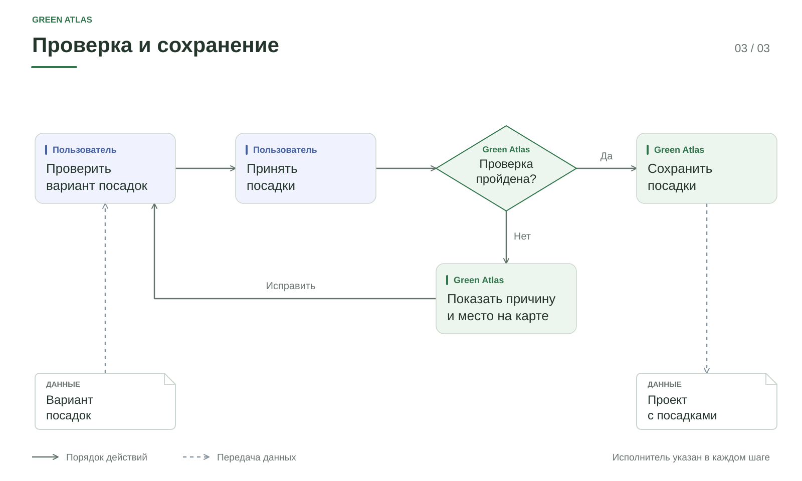

# Продукт и пользовательский путь

## 1. Подготовить проект

Открыть чертёж в AutoCAD и проверить доступность внешних ссылок.
Запустить Green Atlas через плагин. В приложении проверить предложенные
назначения слоёв, выбрать расчётную границу и подготовить карту.

Сопоставление определяет смысл объекта, но не исправляет его геометрию.
Замечания к чтению и контурам рассматриваются отдельно.
Подробнее: [[03 Модули/Работа с CAD и DXF|подготовка CAD]].

## 2. Найти места

Выбрать существующий рабочий участок или нарисовать новый.
Указать породу, размер, количество и способ размещения.
Сервис строит область поиска и проверяет предложенные позиции.

Схема показывает основной цикл проверки. Подбор заканчивается при достижении
количества, исчерпании кандидатов или бюджета поиска. Частичный результат
не означает, что свободных мест на территории больше нет.
Подробнее: [[03 Модули/Проектирование посадок|алгоритм подбора]].

## 3. Проверить и сохранить

Рассмотреть места на карте и замечания к ним. При необходимости изменить
вариант. Подтвердить посадки. Перед записью сервис проверяет актуальность
плана и исходных данных.

Геометрическое замечание связано с позицией на карте. Ошибка актуальности
требует нового предпросмотра, а не перемещения растения.
Сохранённые посадки доступны при повторном открытии проекта.

## Работа с неполным исходником

| Ситуация | Действие |
|---|---|
| Не определено назначение слоя | Выбрать подходящий тип и подтвердить решение |
| Есть предложение восстановления контура | Рассмотреть геометрию с окружением и принять либо отклонить предложение |
| Объект доступен только как линия | Проверить его назначение; линия может учитываться без площади |
| Не прочитан объект или внешняя ссылка | Восстановить исходные данные либо принять явно неполный расчёт |
| Результат устарел | Повторить подготовку или предпросмотр по актуальным данным |

Подтверждение исключения слоя отключает его учёт. Оно не является способом
исправления неизвестной геометрии.

## Результат

В локальном проекте сохраняются участки, растения, решения и история.
Выпуск DXF для этого CAD-входа не входит в доступный сценарий:
[[03 Модули/Проверка и выпуск|проверка и выпуск]].
