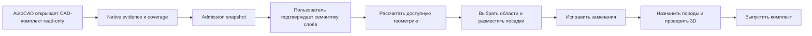

# Продукт и пользовательский путь

Основной пользователь — проектировщик, который работает с реальным CAD-чертежом и должен получить редактируемую, проверяемую и экспортируемую схему посадок.

## Сквозной путь

## Действия пользователя

| Этап | Действие | Ответ системы |
|---|---|---|
| Extraction | Запустить передачу из AutoCAD | Read-only evidence и coverage, включая XREF |
| Admission | Дождаться проверки snapshot | Допущенная геометрия либо компактные замечания |
| Сопоставление | Подтвердить роли слоёв | Основание для расчёта; не следствие extraction |
| Расчёт | Явно использовать доступную геометрию | Ограничения с scope и остаточными замечаниями |
| Области | Выбрать контур или обвести участок | Проверенный полигон рабочей области |
| Проектирование | Поставить объект, ряд, заполнение или кисть | Preview допустимых и отклонённых изменений |
| Проверка | Перейти к замечанию | Причина, место и требуемое действие |
| Породы | Назначить ревизию группе | Прогноз кроны и корней по горизонтам |
| Выпуск | Создать draft или final | Связанный набор неизменяемых артефактов |

## Принцип взаимодействия

Один этап отвечает на один вопрос. Остаточная неполнота не должна стирать доступную геометрию или ронять проект: она остаётся в coverage и компактных замечаниях. Семантика слоя не выводится из успешного геометрического admission.
