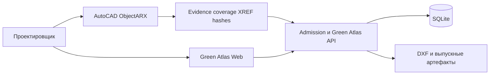
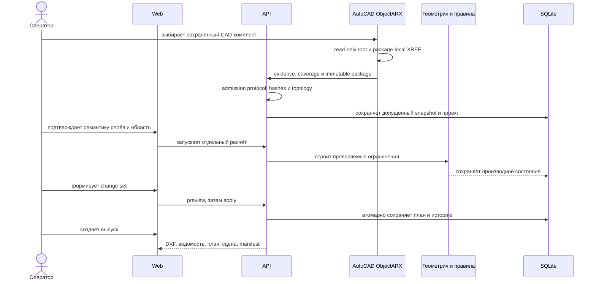

# Общая архитектура

Система разделена на веб-клиент, модульный API, SQLite-хранилище и AutoCAD/ObjectARX production-provider. Для native-пути AutoCAD является источником расчётной геометрии; DXF остаётся обменным и выпускным форматом, но не параллельным production parser.

## Контекст



## Контейнеры

| Контейнер | Ответственность |
|---|---|
| `apps/web` | Пользовательский маршрут, карта, редактор, 3D и выпуск |
| `apps/api` | Проекты, CAD intake, геометрия, планирование, проверки, история и экспорт |
| `packages/ui` | Предметно-нейтральные UI-компоненты и токены |
| `packages/api-client` | Типы, генерируемые из OpenAPI |
| `tools/autocad-bridge` | Каноническое native extraction, evidence и delivery из AutoCAD |
| SQLite | Проекты, операции, история, разговоры и agent runs |

## Backend-слои

```text
HTTP API → application-сценарии → domain contracts и ports → adapters
```

Domain-контракты не должны зависеть от FastAPI, SQLite или конкретной библиотеки геометрии. Shapely строит производные формы из уже допущенного native snapshot; ezdxf остаётся legacy/обменным путём, не источником геометрии native production-flow.

## Frontend-слои

```text
app/pages → features → entities/domain UI → @green/ui
                                  ↓
                         @green/api-client
```

OpenLayers изолирован внутри картографических компонентов. Расчёт нормативов выполняется на backend, а не дублируется в браузере.

## Основной runtime


