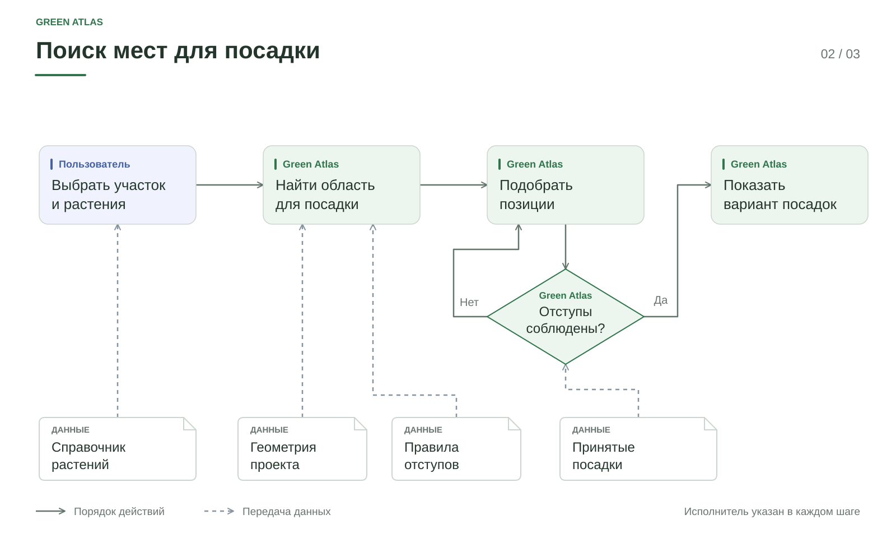

# Проектирование посадок

## Назначение

Сформировать вариант размещения растений в выбранном участке
и передать его пользователю для проверки.

## Вход и результат

Вход: рабочий участок, порода, размер, количество, способ размещения,
подготовленные ограничения и сохранённые посадки.

Результат: найденные позиции, число размещённых растений, причина остановки
и замечания. Предпросмотр сам по себе не изменяет сохранённый план.

## Алгоритм

1. Получить область поиска из модуля геометрии и правил.
2. Сформировать очередь пробных позиций.
3. Проверить границу участка и расстояния от препятствий.
4. Проверить соседство с сохранёнными и уже принятыми растениями.
5. Добавить подходящую позицию в рабочий вариант и индекс занятых мест.
6. Исключить из очереди близкие к принятой посадке пробы.
7. Продолжить подбор до условия остановки.

Отклонённая проба не занимает место и не мешает следующим кандидатам.
«Принятые посадки» на схеме включают сохранённые растения и позиции,
уже прошедшие проверку в текущем варианте.

## Завершение поиска

| Причина | Смысл результата |
|---|---|
| Достигнуто количество | Сформирован запрошенный вариант |
| Исчерпаны кандидаты | В проверенной очереди больше нет подходящих проб |
| Исчерпан бюджет | Поиск остановлен по времени или количеству проб |

Схема показывает цикл проверки, но не все условия остановки.
Алгоритм может вернуть частичный результат. Это не доказательство
максимальной вместимости участка и не утверждение об отсутствии других мест.

Технические бюджеты принадлежат общей конфигурации правил.
Конкретные значения не дублируются в документации планировщика.

## Ручное размещение

Ручная посадка и автоматический подбор используют общий модуль проверки.
Изменение способа ввода точки не отключает известные препятствия и отступы.

## Применение

Перед сохранением проверяются ревизия проекта, основания расчёта
и изменения плана. Устаревший вариант требуется сформировать заново.
Подробности: [[03 Модули/Проверка и выпуск|проверка и сохранение]].

## Зависимости

- [[03 Модули/Геометрия и нормативы|Геометрия и правила]] предоставляют ограничения.
- Справочник предоставляет конкретную ревизию породы и размер.
- Рабочие участки определяют территорию размещения.
- Сохранённый план определяет существующее соседство.
- Хранилище фиксирует только принятые изменения.

Основной код: candidate_queue.py, candidate_search.py,
pattern_application.py в apps/api/app/planning.
