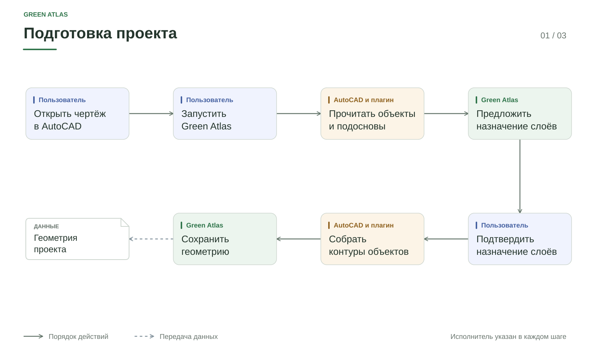

# Подготовка CAD

## Назначение

Получить расчётную геометрию из открытого DWG/DXF через AutoCAD
с сохранением происхождения объектов и причин пропусков.

## Вход и результат

| Вход | Результат |
|---|---|
| Открытый чертёж, блоки и доступные XREF | Захват объектов и диагностические сведения |
| Назначения слоёв и решения о контурах | Подготовленные области, линии и точки |
| Единицы и параметры точности | Геометрия, пригодность которой можно проверить |

Потребители результата: геометрический расчёт, карта, диагностика и полнота.

## Порядок работы

1. Прочитать объекты и экземпляры блоков в контексте открытого чертежа.
2. Зафиксировать источники, внешние ссылки, единицы и отказы чтения.
3. Передать данные приложению с проверкой целостности.
4. Применить назначения слоёв и решения пользователя.
5. Восстановить поддерживаемые составные области через AutoCAD.
6. Сохранить расчётное представление и адресные замечания.

Назначение слоя и пригодность геометрии — разные свойства.
Слой «здания» может содержать отдельные линии, составные контуры и детали.
Версия плагина в файле передачи должна входить в список версий локального API
и компилятора снимка. Несовпадение останавливает захват до создания проекта;
пустой экран после такой ошибки не означает потерю XREF. При сборке пакета
проверяется согласование версии нативного плагина с обоими приёмниками.

## Распознавание слоёв

Сервис сначала предлагает типы по названиям. При подключённой модели Luna
анализирует имена слоёв, контекст подосновы, число и типы объектов.
Координаты и файлы чертежа модели не передаются.
Для новых запросов к OpenAI используется повышенная глубина анализа Luna.
Она может улучшить предложения по названиям, но не восполняет отсутствующие
в чертеже параметры сетей. После распознавания единственный пригодный
замкнутый контур с явным названием зоны работ или проектирования выбирается
автоматически. Если таких контуров несколько, решение остаётся открытым.

Список обрабатывается партиями. Интерфейс показывает число обработанных слоёв,
источник предложений и возможность повторить неудавшийся запрос.
Готовые предложения сохраняются для того же исходника и состава слоёв.
Если все назначения уже сохранены и подтверждены, открытие проекта не
запускает распознавание заново и не показывает ложный прогресс.
После первого прохода отдельный запрос рассматривает только спорные слои.
Он может уточнить категорию или задать короткий вопрос с несколькими
расчётными ролями. Ему дополнительно доступны типы геометрии, число
непрочитанных объектов и размеры охвата слоя без координат. Сохранённый
первый результат повторно не отправляется
целиком. Если второй запрос недоступен, остаются предложения первого прохода.

При новом импорте роли с явным расчётным назначением применяются и сохраняются
автоматически. Для роли инженерной сети достаточно распознать саму сеть:
неизвестный подтип не требует ручного подтверждения слоя. Выбор границы
территории при нескольких пригодных вариантах, сомнительные исключения и
категории без расчётной роли остаются на проверку. Отдельная граница заказа
топографической съёмки при однозначной границе работ остаётся справочной.
Незамкнутый альтернативный контур не участвует в выборе территории, но причина
его непригодности остаётся видимой. Геометрия демонтажа консервативно участвует в ограничениях, пока её удаление
не подтверждено. Слои замечаний из текстов, выносок и круговых меток могут
исключаться как аннотации; слой вопросов с физической линией так не исключается.
Границы растительности и грунта, откосы и внутренние
элементы не объявляются препятствиями только по имени слоя: такое назначение
может ложно сократить пригодную для посадки площадь. Сохранённые предложения используют актуальный классификатор сервиса,
поэтому старая версия перечня ролей в кеше не может превратить описательную
категорию в препятствие. Интерфейс кратко показывает,
сколько слоёв принято и сколько требует решения. Газон не сводится к
существующим деревьям, тротуар сохраняет свой тип. Ранее принятые назначения
не перезаписываются.
Высокая уверенность модели сама по себе не разрешает исключать смешанную
геометрию из расчёта. Для исключения нужен явный смысл названия или состав
объектов только из аннотаций. Вопросы к сетям с линиями остаются на проверке.

Модель выбирает из общего классификатора и кратко объясняет выбор.
Сервис проверяет категории и идентификаторы. Пользователь разбирает спорные
назначения; модель не перезаписывает принятые решения и не задаёт нормативные
отступы, диаметр трубы или напряжение сети по догадке.

Прототип может включать сохранённые предложения OpenAI. Они применяются только
при совпадении хеша чертежа, списка и состава слоёв, модели и версии инструкции.
Интерфейс явно показывает, что ответ сохранённый. Ключ API в такой пакет не
входит. Для другого исходника нужен
настроенный API либо самостоятельное назначение слоёв.

Подтверждённые человеком назначения хранятся в своём проекте. Новый проект
получает предложения общего распознавателя; чужие решения в него не переносятся.
Предложения не исправляют геометрию и не заменяют проверку пропусков XREF.

В интерфейсе сначала выбирается граница проектных работ: она определяет,
внутри какой территории строится карта ограничений. Граница заказа может
охватывать более широкую территорию; наибольшая площадь сама по себе не
является основанием для выбора. Топография обозначает исходную съёмку, а не
приоритет границы. Рабочие участки для посадки задаются позже
на карте. Для спорного слоя сначала выбирается одна из короткого списка
расчётных ролей; подробный тип ищется в компактном выпадающем списке внутри
дополнительной настройки и не раздвигает таблицу. Если в сохранённом проекте
нет каталога распознавания, пустой список не показывается. Группы
незавершённых решений показываются по одной с переходом назад и вперёд;
полный список слоёв доступен отдельно.

Распознанный подробный тип описывает содержимое слоя, но не всегда задаёт
участие его геометрии в расчёте. Для смешанного слоя назначение подробного
типа само по себе не завершает проверку: интерфейс отдельно показывает,
что расчётная роль не определена. Выбор роли применяется ко всем объектам
слоя и влияет на проверку мест посадки; это явно подписано рядом с выбором.
Один и тот же контроль смысла назначения нужен для ручных и модельных решений.

Открытая линия не становится границей расчёта только из-за назначения роли.
Выбор территории допускает контур с проверенной площадью, переданной из
AutoCAD. Старое назначение неподходящей линии показывается как ошибка выбора:
карту требуется подготовить заново после выбора пригодного контура. Если
площадной границы нет, рабочую область можно задать вручную на карте без
ложного назначения линии.

Настройка провайдера: [[05 Эксплуатация/Запуск и эксплуатация]].

Основное действие на этапе подготовки одно: «Подготовить карту». Если нужно
выбрать границу или разобрать спорные слои, оно открывает нужную секцию.
Если часть объектов не получила расчётной геометрии, рядом с действием
показано предупреждение. Нажатие сохраняет решение работать по доступным
объектам и запускает подготовку; непрочитанные объекты остаются в адресном
отчёте и не считаются проверенными.

## Восстановление областей

Сборщик ищет связанные кривые и допустимые фрагменты границ.
Объекты не объединяются только потому, что находятся на одном слое.
Для полученной области сохраняется связь с исходными частями.

Читаемые линии, не вошедшие в область, остаются линейными объектами.
Замкнутая петля инженерной сети не становится площадью здания.
Предложенные исправления и решения пользователя учитываются при подготовке.

## Ошибки и ограничения

| Ситуация | Значение |
|---|---|
| Недоступная XREF | Часть внешнего источника не прочитана |
| HATCH без полученной области | Штриховка не предоставила пригодную площадную геометрию |
| Линия без площади | Доступна кривая, но не подтверждена внутренняя область |
| Ошибка целостности передачи | Нельзя доверять пакету данных; требуется повторная передача |
| Устаревшая связь для CAD-коррекции | Требуется открыть исходник и восстановить связь |

Подтверждение назначения слоя не исправляет HATCH и не загружает отсутствующую
подоснову. Новый CAD-парсер не используется как резервный путь.

## Сохранность

Исходный DWG не перезаписывается приложением. Захват может изменить флаг
несохранённых изменений AutoCAD (DBMOD); это не равнозначно записи файла.
Исправления и подготовка должны сохранять происхождение объектов.

## Зависимости и актуальность

Новая CAD-подготовка требует работающего AutoCAD. Готовый снимок используется
локально. Ключ актуальности описан в
[[02 Архитектура/Данные и интеграции|контракте данных]].

Контроль модуля: [[04 Качество и показатели/Качество и показатели]].
