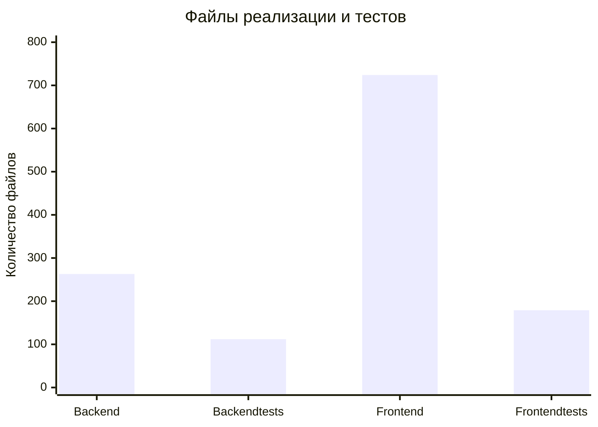

# Качество и показатели

Текущие числа описывают размер проверяемой поверхности репозитория. Они не заменяют coverage, benchmark или приёмку на реальных данных.

## Состав

| Показатель | Значение | Метод |
|---|---:|---|
| Python-файлы backend | 263 | `find apps/api/app -name '*.py'` |
| Backend test-файлы | 112 | `find apps/api/tests -name 'test_*.py'` |
| TS/TSX-файлы web | 724 | `find apps/web/src` |
| Frontend и E2E test-файлы | 179 | поиск `*.test.*` и `*.spec.*` |
| Markdown в `docs` | 269 | `find docs -name '*.md'` до создания этого vault |
| OpenAPI paths | 73 | ключи `openapi.json.paths` |
| OpenAPI operations | 77 | HTTP-операции в `openapi.json` |

## Что проверяется тестами

- DXF import, reader resilience и geometry fidelity;
- CAD intake, preview, capacity и native snapshot;
- области, размещение, паттерны и change sets;
- ограничения, сети и rule trace;
- история, конкуренция и восстановление;
- release round-trip и целостность экспорта;
- agent lifecycle, preview и control flow;
- frontend-компоненты и Playwright-сценарии.

## Подтверждённый native receipt

| Показатель Кустанайской | Значение |
|---|---:|
| Source instances | 101829 |
| Native calculation instances | 79625 |
| Context instances | 22197 |
| Unresolved instances | 7 |
| Regions / paths / points | 3089 / 76444 / 92 |
| Block references | 12893 / 12893 |
| Resolved XREF | 2 / 2 |
| Unreadable / cyclic | 0 / 0 |
| Topology verifier | `passed=true` |
| Compiler/MCP/topology set in receipt 22 Sep | 37 passed |
| Re-run in this documentation update | 35 compiler+MCP passed (24 + 11) |

`AcDbHatch::getRegionArea()` восстановил 330 из 336 ранее unresolved HATCH. Остались шесть HATCH и одна повреждённая closed polyline: это 0,0069% source instances, они видимы в coverage и не блокируют snapshot admission. Набор из 37 в receipt включает topology-verifier; текущая адресная проверка этой документации запускала доступные 24 compiler и 11 MCP тестов.

## Неподтверждённые показатели

Пока нельзя публиковать:

- процент покрытия кода;
- среднее время обработки рабочего DXF;
- предел одновременно работающих пользователей;
- экономию времени проектировщика;
- точность автоматического предложения;
- совместимость со всеми CAD-файлами.
- корректность пользовательской классификации слоёв по одному successful snapshot;
- готовность нормативного расчёта или выпуска только по факту native admission.

Для этих утверждений нужны отдельные воспроизводимые измерения на зафиксированных входах.
