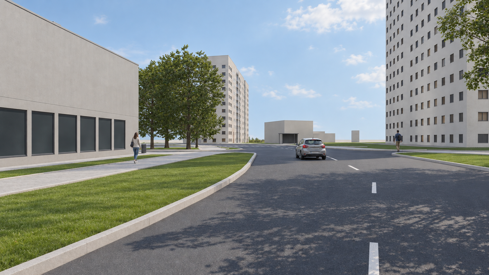
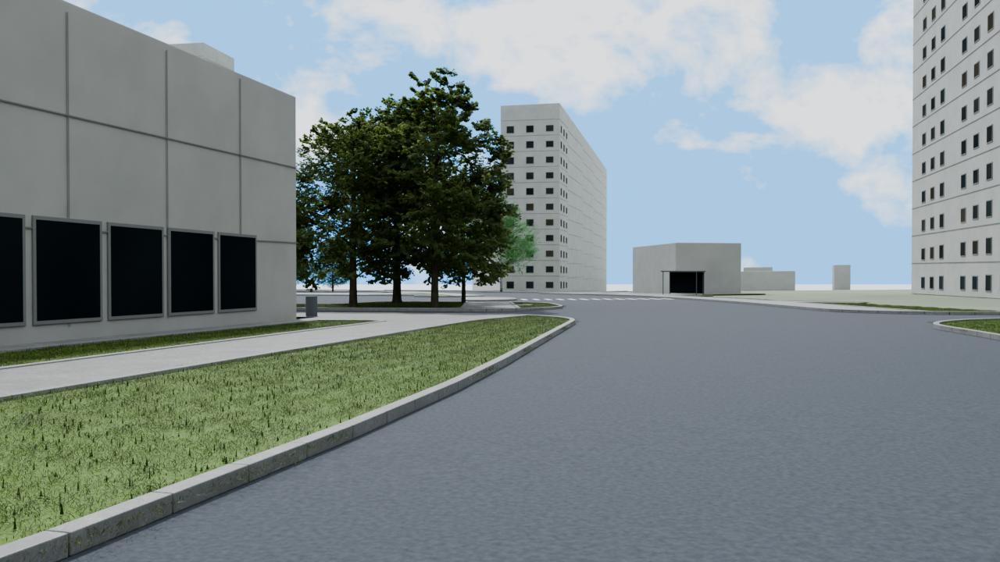

# Демо визуальной цепочки Green Atlas

Это отдельный демонстрационный комплект рядом с установщиком прототипа. Его можно просмотреть прямо на GitHub по изображениям ниже или открыть `index.html` после скачивания папки. **Установленное приложение Green Atlas пока не умеет импортировать этот Blender-пакет как проект или превращать произвольный DWG в такой рендер.** Установщики, CAD-архив и рабочие проекты этим комплектом не изменяются.

Полный `.blend` размером 642 МБ в Git не включён: он содержит ссылки на локальные сторонние ассеты, в том числе Botaniq, и сам по себе не является переносимым приложением. Для анализа здесь приложены [объектный пакет сцены](scene-packet.json.gz), [подготовленный пространственный контекст](world.json.gz) и [параметры нативного рендера с хешами моделей](render-receipt.json). Это исторический снимок данных, **не новый вход CAD и не готовый импортёр**. После распаковки JSON в нём останутся абсолютные пути автора к локальным PBR и CAD-файлам; на другой машине их требуется сопоставить с собственными легально доступными источниками. Права на распространение Botaniq-ассетов этим пакетом не предоставляются.

Кадр [last-quality-target.png](quality-target/last-quality-target.png) — выбранный пользователем поздний ориентир качества: фактура фасадов, матовые тёмные витрины и дорожная разметка читаются лучше, чем в ранних нейроверсиях. Приложенный JPEG сохранён рядом как `quality-target/user-reference.jpg`; это тот же кадр после уменьшения и JPEG-сжатия (нормализованная пиксельная ошибка после приведения к 1280 × 720 около 1,8%). PNG найден среди сохранённых результатов ImageGen.



Нативный Cycles-кадр из сохранённой сцены:



Основной ряд `street/01`–`street/04` построен вокруг **одной сохранённой Blender-сцены от 23 сентября 2026 года**. `01` и `02` повторно выведены из неё с прежней камерой и геометрией. `03` — сохранённый Cycles-кадр этой сцены. `04` — новая нейроотделка именно `03`. `05` — панорама Яндекс Карт рядом с Кустанайской улицей, 10А. Не установлено, что поздний качественный кадр получен именно из этого `.blend` и кадра `03`; поэтому он показан **как ориентир качества отдельно от непрерывной цепочки**.

| Этап | Файл | Что показывает |
| --- | --- | --- |
| 1 | `street/01-clay.png` | Сцена в Blender Workbench без фотореалистичных материалов. |
| 2 | `street/02-green-mask-highlight.png` | Те же объекты и камера; классы озеленения подсвечены цветом. Это **диагностическая подсветка по именам объектов**, а не расчётная пиксельная маска из CAD. |
| 3 | `street/03-cycles.png` | Нативный Blender/Cycles с материалами, Botaniq, травой и светом. В исходном receipt он обозначен как прототип геометрии и материалов, ещё не одобренный beauty-кадр. |
| 4 | `street/04-imagegen.png` | Иллюстративная нейроотделка кадра 3 без заданных машин и людей. Она изменяет пиксели, оттенки, кроны и фасады; **не служит подтверждением размеров, материалов или неизменности объектов**. |
| 5 | `street/05-yandex-reference.jpg` | Панорама Яндекс Карт 2025 года и мини-карта, сохранены подпись и атрибуция. Точка 37.753777, 55.618724, направление приблизительно 8°. Это та же улица вблизи 10А, но **не точно та же камера**, сезон и момент времени. |

На исходной рабочей машине Blender-сцена находится в `artifacts/metric-scene-20260923/native-rebuild/final-native/street-geometry-prototype.blend`. Этого файла **нет** в данном репозитории. Параметры и источники зафиксированы в соседнем `render-receipt.json`; исходный `street-geometry-prototype.png` соответствует этапу 3. Следующая команда воспроизводит этапы 1 и 2 **только при наличии локального `.blend` и его внешних ассетов**:

```bash
/Applications/Blender.app/Contents/MacOS/Blender --background \
  artifacts/metric-scene-20260923/native-rebuild/final-native/street-geometry-prototype.blend \
  --python output/render-demo-20260929/render_workbench_stages.py -- \
  output/render-demo-20260929/street
```

Сцена использует внешние ассеты, включая Botaniq; для повторного рендера нужен доступ к путям, перечисленным в receipt. Условия использования сторонних ассетов для публикации и продакшена отдельно не подтверждались. Сама сцена построена историческим диагностическим DXF/картографическим маршрутом, а **не текущим продуктовым входом AutoCAD → плагин → Green Atlas**. Сохранённый пакет опирается на восстановленную привязку и упрощённую высотную поверхность. Эта папка демонстрирует визуальные стадии, не доказывает автоматическую сборку для любого DWG.

Целостность файлов из пакета проверяется `python3 verify_package.py`; хеши также перечислены в `manifest.json`.

`appendix/` содержит три сохранённые пары «Cycles → ImageGen» от 21 сентября: улица, обратный ракурс и вид сверху. Внутри каждой пары нейроизображение было получено от соответствующего нативного кадра. Их прежний `.blend` и маски не сохранились, поэтому пары **нельзя выдавать за дополнительные ракурсы сцены от 23 сентября**.

В качественном ориентире появились машина и прохожие. Они служат только иллюстрацией поздней отделки; их положение не подтверждено объектным пакетом. То же относится к нарисованной разметке: она визуально улучшает кадр, но пока не служит доказательством соответствия дорожным данным.

`flowchart.png`, `flowchart.svg` и `flowchart.dot` показывают **целевой**, пока не полностью реализованный путь: AutoCAD снимок, локальное сопоставление с картографией, проверенный пакет объектов, Blender/Cycles, необязательная нейроотделка и контроль. Внешняя картография должна иметь источник и дату. Пропуски и сомнительная привязка остаются видимыми замечаниями.

Источник снимка: [Яндекс Карты, Кустанайская улица](https://yandex.com/maps/213/moscow/?ll=37.753371%2C55.618929&panorama%5Bdirection%5D=8.181318%2C0.000000&panorama%5Bfull%5D=true&panorama%5Bpoint%5D=37.753777%2C55.618724&panorama%5Bspan%5D=91.492845%2C60.000000&z=18). Панорама — наблюдательный референс, не ассет для рендера.
